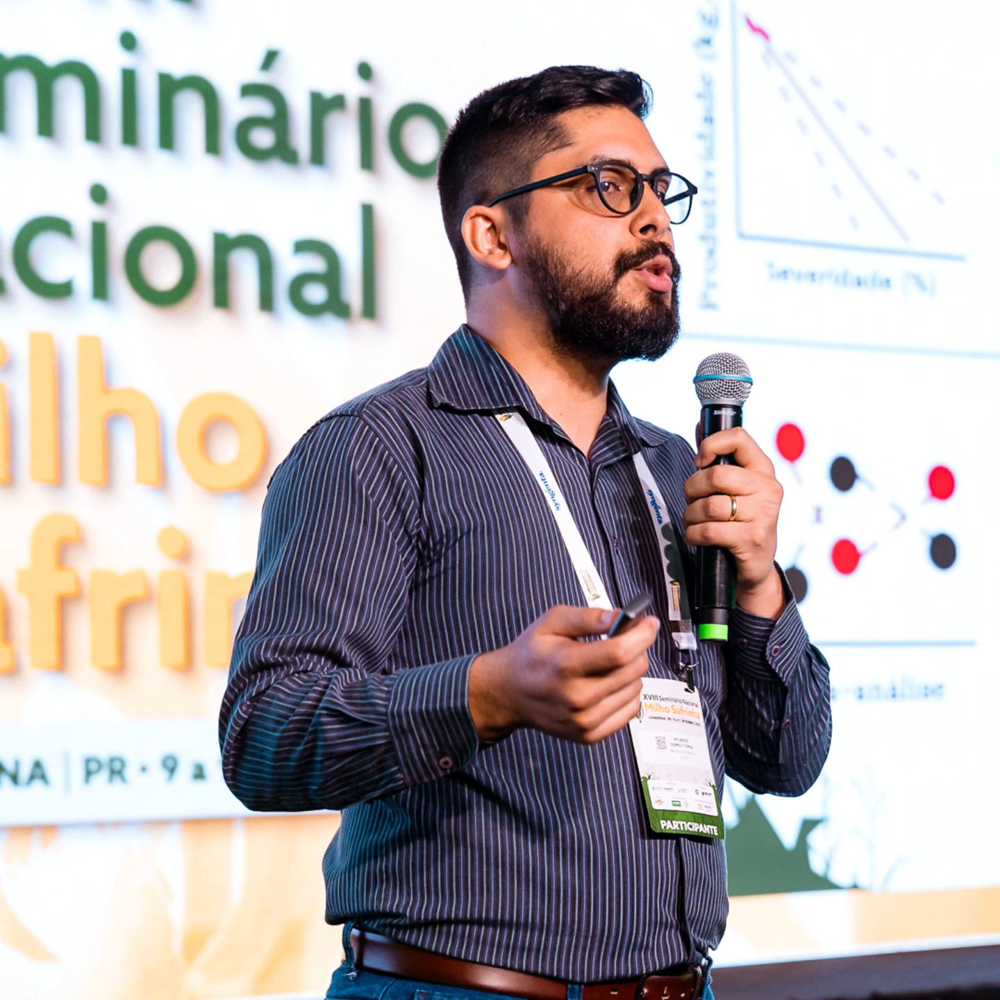

```{=html}
<section class="about-section">

  <!-- INTRO IMAGE (opcional) -->
  <div class="about-image">
    
  </div>

  <!-- RESUME -->
  <div class="about-block">
    <h2>Who am I?</h2>

    <p>
      I am a PhD Researcher in Plant Pathology working at the intersection of plant
      disease epidemiology, predictive modeling, and data-driven approaches for
      crop protection.
    </p>

    <p>
      My research focuses on understanding how plant diseases develop over space
      and time and how quantitative models can support better decision-making in
      real agricultural systems.
    </p>
  </div>

  <!-- RESEARCH -->
  <div class="about-block">
    <h2>Research Focus</h2>

    <ul>
      <li>Plant disease epidemiology and risk forecasting</li>
      <li>Climate–disease relationships and agroclimatic drivers</li>
      <li>Machine learning applications in plant pathology</li>
      <li>Spatial and temporal modeling of disease outbreaks</li>
      <li>Decision-support systems for crop protection</li>
    </ul>
  </div>

  <!-- METHODS -->
  <div class="about-block">
    <h2>Methods & Expertise</h2>

    <ul>
      <li>Epidemiological and statistical modeling</li>
      <li>Machine learning and computer vision</li>
      <li>Geospatial and spatiotemporal analysis</li>
      <li>Reproducible research workflows</li>
    </ul>
  </div>

  <!-- AFFILIATION -->
  <div class="about-block">
    <h2>Affiliation & Collaboration</h2>

    <p>
      I am currently conducting my PhD research in Plant Pathology, with
      international collaboration between research groups in Brazil and the
      United States.
    </p>

    <p>
      My work bridges academic research, applied field studies, and
      extension-oriented initiatives.
    </p>
  </div>

  <!-- CAREER -->
  <div class="about-block">
    <h2>Career Interests</h2>

    <ul>
      <li>Research & Development (R&D)</li>
      <li>Data Science and Quantitative Epidemiology</li>
      <li>Crop Protection and AgTech</li>
      <li>Predictive analytics for agricultural decision-making</li>
    </ul>
  </div>

</section>
```