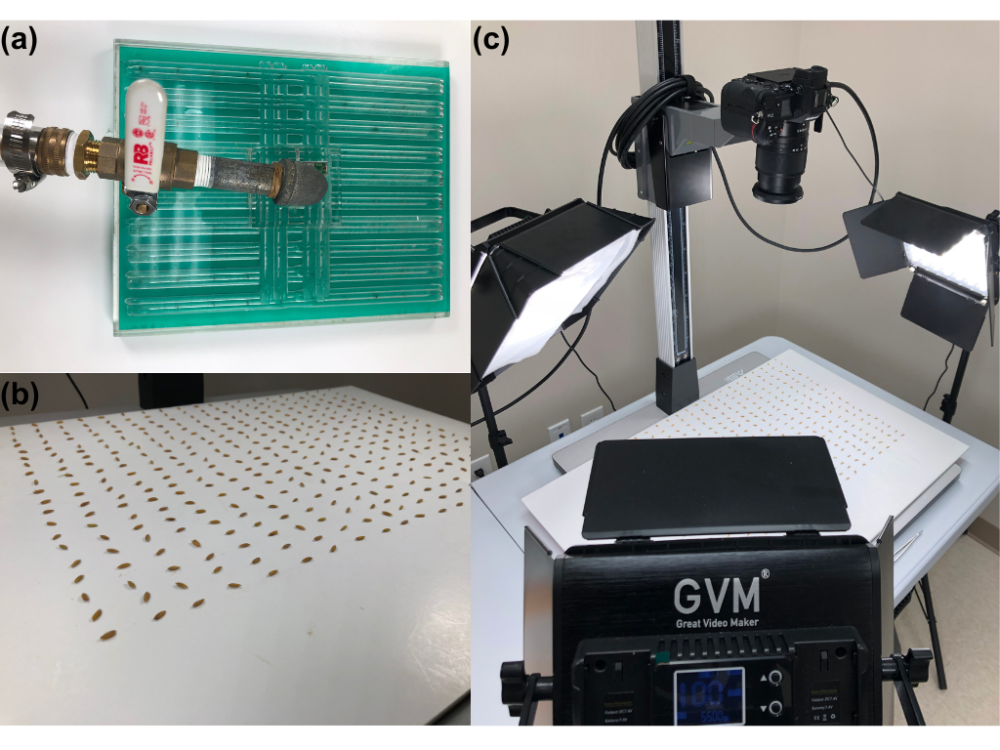
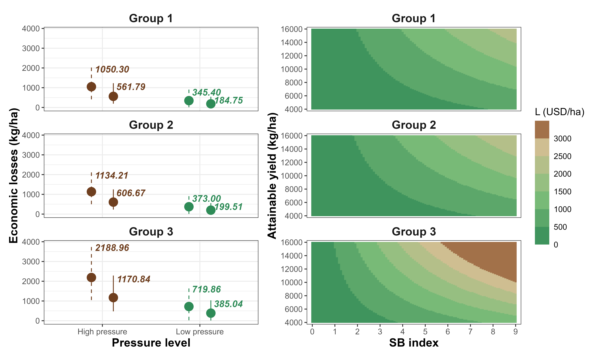
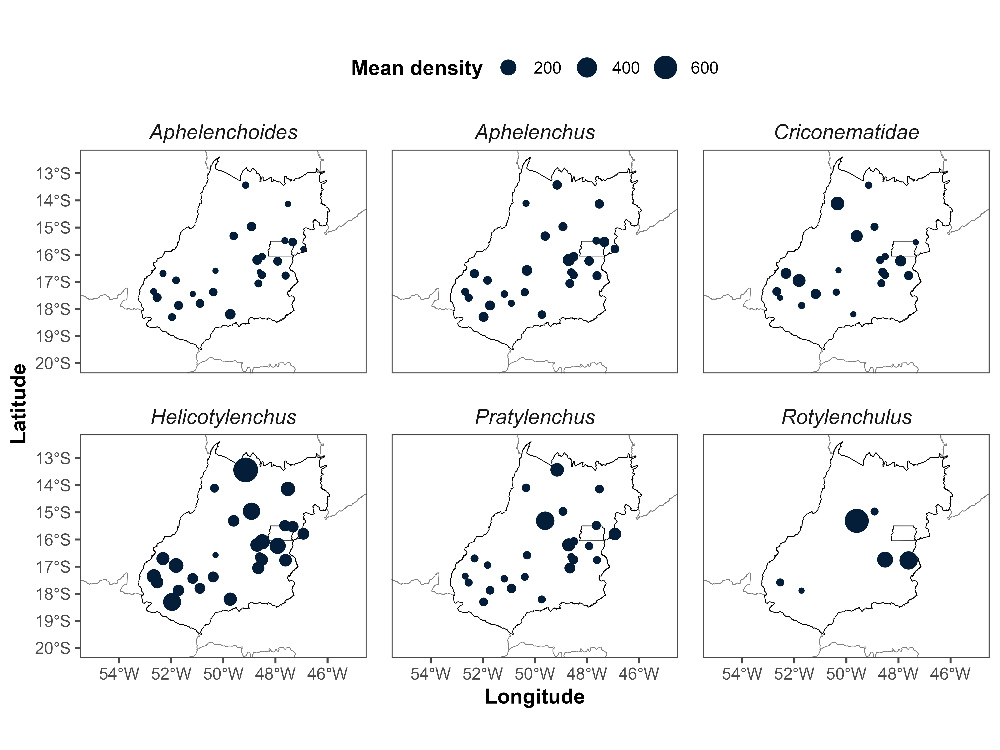
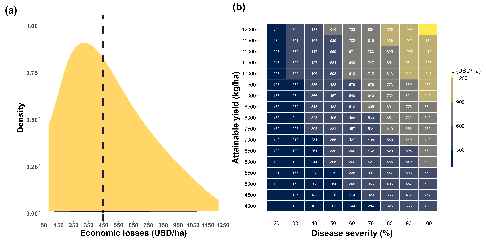
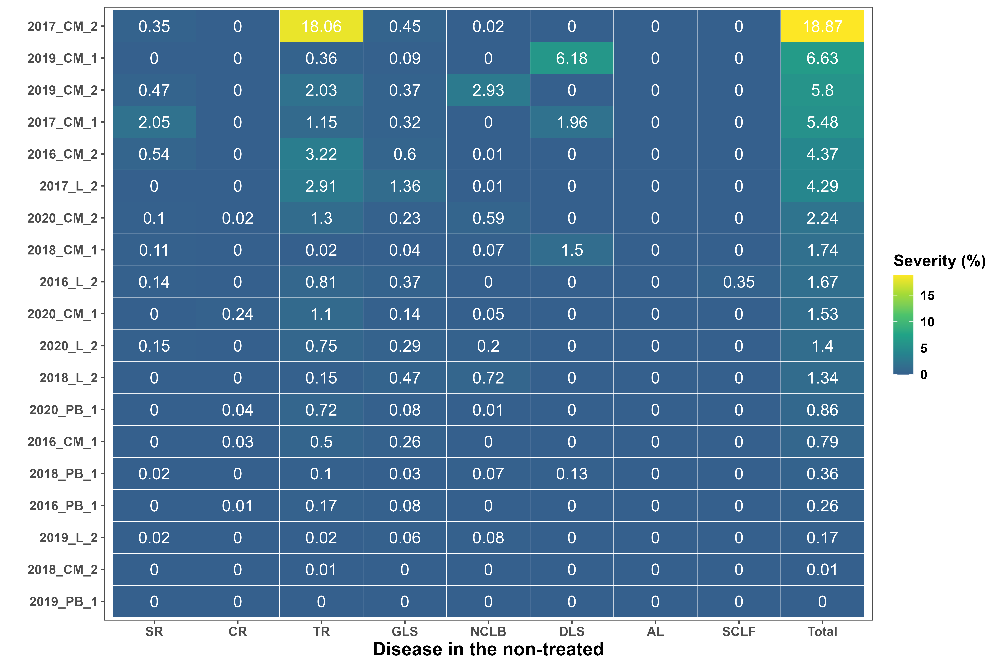
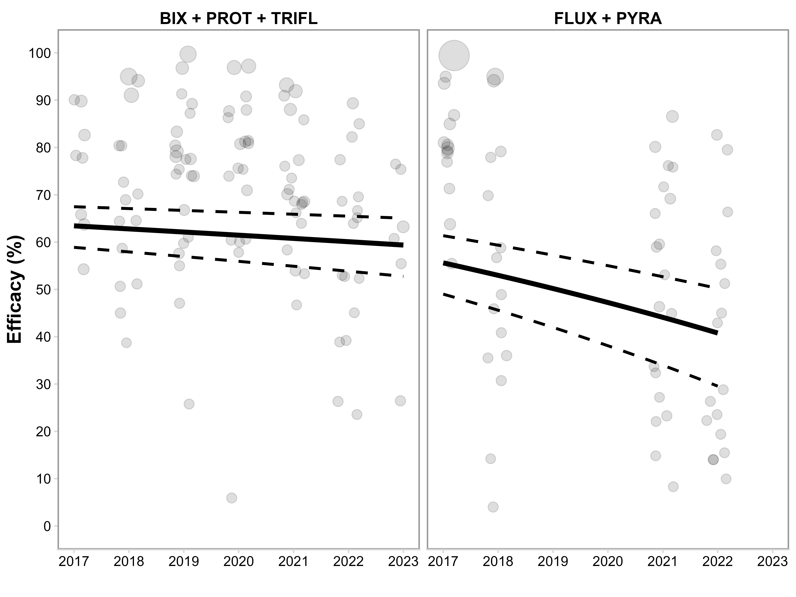

```{=html}
<section class="work-section">

  <!-- ARTICLE 1 -->
  <div class="work-item">
    <div class="work-image">
      
    </div>

    <div class="work-content">
      <h3>
        Exposure–Lag Responses of Soybean Target Spot to Climatic Proxies: A Distributed Lag Nonlinear Modeling Approach
      </h3>

      <p class="work-meta">
        <em>Phytopathology</em> · 2026
      </p>

      <p>
        (i) characterize the influence of  weather-related variables, such as accumulated precipitation, maximum temperature, and vapour pressure deficit, on epidemics during the soybean growing season; (ii) quantify their delayed and non-linear effects on final disease severity of target spot using a DLNM; (iii) predict disease severity under contrasting scenarios of environmental suitability;  and (iv) assess the historical spatiotemporal patterns of climatic favorability and epidemic risk for soybean target spot under contrasting planting windows across major soybean‑producing regions.
      </p>

      <p class="work-links">
        <a href="#" target="_blank">Paper</a>
        ·
        <a href="#" target="_blank">Code</a>
      </p>
    </div>
  </div>

  <hr>

  <!-- ARTICLE 2 -->
  <div class="work-item">
    <div class="work-image">
      
    </div>

    <div class="work-content">
      <h3>
        YOLO-based Phenotyping of Kernel Smut in Rice Seeds Under Different Lighting Conditions
      </h3>

      <p class="work-meta">
        <em>Frontiers in Plant Science</em> · 2026
      </p>

      <p>
        The objective of this study was to develop a YOLO-based computer vision algorithm capable of enabling efficient and accurate phenotyping of rice kernels across different seed morphologies and lighting conditions based on images from visible regions. In addition, this study aimed to provide a user‑friendly platform to facilitate rice seed phenotyping as well as diseased seeds monitoring based on automated image analysis, thereby supporting standardized, reproducible, and scalable disease assessment.

      </p>

      <p class="work-links">
        <a href="#" target="_blank">Paper</a>
        ·
        <a href="#" target="_blank">Code</a>
      </p>
    </div>
  </div>

  <hr>
  
    <!-- ARTICLE 3 -->
  <div class="work-item">
    <div class="work-image">
      
    </div>

    <div class="work-content">
      <h3>
        Quantifying yield and economic losses of rice Sheath Blight across different genotype responses: A framework simulation using damage functions
      </h3>

      <p class="work-meta">
        <em>Preprint</em> · 2026
      </p>

      <p>
        The objective of this study was to quantify the yield and economic losses of rice Sheath blight across different genotype based on stochastic simulations.

      </p>

      <p class="work-links">
        <a href="#" target="_blank">Paper</a>
        ·
        <a href="#" target="_blank">Code</a>
      </p>
    </div>
  </div>

  <hr>

<!-- ARTICLE 4 -->
  <div class="work-item">
    <div class="work-image">
      
    </div>

    <div class="work-content">
      <h3>
        Unraveling the Spatial Distribution of Plant-Parasitic Nematodes in Maize Fields in the Brazilian Cerrado: The Impact of Environmental and Cultural Drivers Modeled Mathematically
      </h3>

      <p class="work-meta">
        <em>Preprint</em> · 2026
      </p>

      <p>
        The objectives of this study were to (i) identify the morphological groups present in maize production regions in the State of Goiás; (ii) quantify the nematodes populations across different mesoregions, altitude ranges, cultural practices, and soil types; (iii) characterize the spatial heterogeneity of nematode populations; and (iv) quantify the influence of tillage, cultural sequence, altitude, and physical-chemical soil properties on PPNs using mathematical modeling.

      </p>

   <p class="work-links">
        <a href="#" target="_blank">Paper</a>
        ·
        <a href="#" target="_blank">Code</a>
      </p>
    </div>
  </div>
    <hr>
  
  <!-- ARTICLE 5 -->
  <div class="work-item">
    <div class="work-image">
      
    </div>

    <div class="work-content">
      <h3>
        Economic returns on fungicide use across soybean cultivars with varying tolerance to target spot caused by Corynespora cassiicola
      </h3>

      <p class="work-meta">
        <em>Journal of Phytopathology</em> · 2025
      </p>

      <p>
        The additional objectives, taking the different tolerance levels into account, were (i) to determine the break-even probability on the costs of a fungicide program; (ii) to calculate economic returns resulting from fungicide applications; (iii) to assess the economic return  as treatment efficacy declines over time; and (iv) to estimate the economic damage threshold across different control efficacy values.
      </p>

   <p class="work-links">
        <a href="#" target="_blank">Paper</a>
        ·
        <a href="#" target="_blank">Code</a>
      </p>
    </div>
  </div>
    <hr>
    <!-- ARTICLE 6 -->
  <div class="work-item">
    <div class="work-image">
      
    </div>

    <div class="work-content">
      <h3>
        Stochastic modeling of yield losses due to bacterial leaf streak on corn 
      </h3>

      <p class="work-meta">
        <em>European Journal of Plant Pathology</em> · 2025
      </p>

      <p>
       Our study aimed to: (i) model the relationship between BLS severity and corn yield; (ii) establish a threshold severity level for signiicant yield losses; (iii) estimate potential yield damage and economic impacts; and (iv) evaluate the proitability of control treatment.

      </p>

      <p class="work-links">
        <a href="#" target="_blank">Paper</a>
        ·
        <a href="#" target="_blank">Code</a>
      </p>
    </div>
  </div>
     <hr>
     
   <!-- ARTICLE 7 -->
  <div class="work-item">
    <div class="work-image">
      
    </div>

    <div class="work-content">
      <h3>
        When does fungicide use pay off in maize? Evidence from low foliar disease pressure environments in Southern Brazil 
      </h3>

      <p class="work-meta">
        <em>Journal of Phytopathology</em> · 2026
      </p>

      <p>
       Our study aimed to synthesize yield and economic responses to a fungicide program using a random‑effects meta‑analytic approach based on 19 multi‑environment trials conducted across the first and second seasons between 2016 and 2020 in Paraná State, Brazil.

      </p>

      <p class="work-links">
        <a href="#" target="_blank">Paper</a>
        ·
        <a href="#" target="_blank">Code</a>
      </p>
    </div>
  </div>
   <hr>
  <!-- ARTICLE 8 -->
  <div class="work-item">
    <div class="work-image">
      
    </div>

    <div class="work-content">
      <h3>
        Performance of dual and triple fungicide premixes for the control of soybean target spot after seven years of use
      </h3>

      <p class="work-meta">
        <em>European Journal of Plant Pathology</em> · 2024
      </p>

      <p>
       Our study aimed to quantitatively summarize the efficacy of two commonly used fungicide premixes: Orkestra SC (fluxapyroxad + pyraclostrobin) and Fox Xpro (bixafen + prothioconazole + trifloxystrobin) in controlling Target Spot (TS) and protecting yield.

      </p>

      <p class="work-links">
        <a href="#" target="_blank">Paper</a>
        ·
        <a href="#" target="_blank">Code</a>
      </p>
    </div>
  </div>

</section>
```
